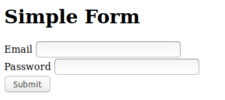

# forms-example

An introduction to HTML forms and Java servlets


## Servlets

Java servlets are compiled Java classes that implement all or part of a web application. They are not standalone Java programs but must be run by a suitable web server.  Though this might seem complicated it actually makes creating and deploying web based applications easier.

## HTML forms

Web pages use forms to allow users to submit data.  Here's an example of a simple form.



The HTML code looks like this -

```
<html>
  <body>
    <h1>Simple Form</h1>
    <form action="EmailForm" method="GET">
        Email <input type="email" name="email">
        <br>
        Password <input type="password" name="password">
        <br>
        <button type="submit">Submit</button>
    </form>
  </body>
</html>
```


When the user submits the form the web browser will try to open the web page called ```EmailForm``` as specified in the ```action=``` property of the ```<form>``` tag.  You should not provide a page with this name, instead you must give this as the ```url-pattern``` for your servlet in the ```web.xml``` file.  The actual request will be something like http://localhost:8080/forms-example-0.1/EmailForm?email=me%40example.com&password=Welcome123/
The data entered in the form is 'encoded' into the URL as a 'query' i.e. everything after the question-mark.  This data will be decoded by your servlet. 

### web.xml

Each Java servlet needs two entries in the ```web.xml``` file located in ```src/main/webapp/WEB-INF```. The first specifies the Java class. In this example it is simply ```Email```, but if you have used packages the full package name is required, e.g. ```com.example.webapp.Email```. The second entry specifies the url pattern mapping, this would normally begin with ```/``` and match the ```action=``` property in the corresponding form.

```
<web-app>
   <servlet>
      <servlet-name>EmailServlet</servlet-name>
      <servlet-class>Email</servlet-class>
   </servlet>
   <servlet-mapping>
      <servlet-name>EmailServlet</servlet-name>
      <url-pattern>/EmailForm</url-pattern>
   </servlet-mapping>
</web-app>
```


See the MDN introduction to writing web forms https://developer.mozilla.org/en-US/docs/Learn/HTML/Forms/Your_first_HTML_form

In this demo you'll find two forms, simple.html and index.html. Both forms do the same thing but index.html has a more polished look. The styling for index.html was achieved by using the Bootstrap open-source front-end framework.

See the Bootstrap documentation for more examples https://getbootstrap.com/docs/4.1/components/forms/


## Running the servlet

To run the servlet build the war file, then deploy using Jetty or Tomcat.

To build the servlet we build the ```package``` target using Maven.  From the command line the command is -

```mvn package```

Which will compile and then package.

Or you could select this from the ```Maven Projects``` in VS Code `Explorer` view.

There are many ways test and run servlets, here are some suggestions.

1. From the command line.

   * Download Jetty from http://www.eclipse.org/jetty/download.html

   * Unzip the downloaded file

   * Copy the WAR file into the ``webapps`` folder

   * In the ``jetty-distribution`` folder, start Jetty with the command

   ```java -jar start.jar```

   * Open the webpage http://localhost:8080

   For more information see
   http://www.eclipse.org/jetty/documentation/9.4.x/quickstart-running-jetty.html


1. As a Maven build.

    The ``Jetty plugin`` is included in this example's ```pom.xml``` enabling Jetty to be installed and started automatically via Maven.  
    
    * Use this command:

        ```mvn jetty:run```

    For more information see https://www.eclipse.org/jetty/documentation/9.4.x/maven-and-jetty.html 

1. Using the VS Code Jetty extension.

    * Install the ``Jetty for Java`` extension. (Reload to enable)

    * Add a Jetty server, select the folder you unzipped to

    * Click right on the .war file in the VS Code Explorer view, 
    choose ```Run on Jetty Server``` 


